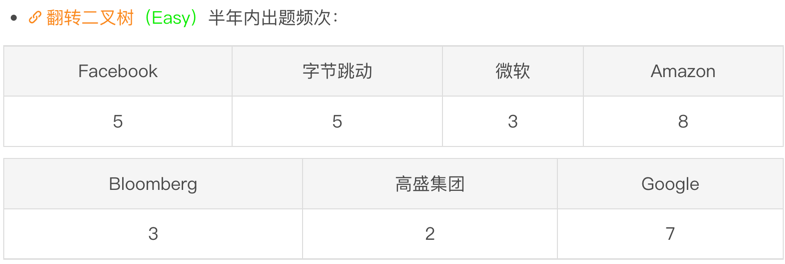

# 刷题笔记

## 3.3 [226. 翻转二叉树](https://leetcode-cn.com/problems/invert-binary-tree/)

难度简单1188收藏分享切换为英文接收动态反馈

给你一棵二叉树的根节点 `root` ，翻转这棵二叉树，并返回其根节点。




```python
# Definition for a binary tree node.
# class TreeNode:
#     def __init__(self, val=0, left=None, right=None):
#         self.val = val
#         self.left = left
#         self.right = right
class Solution:
    def invertTree(self, root: TreeNode) -> TreeNode:
        if not root:
            return None
        root.left, root.right = root.right, root.left
        self.invertTree(root.left)
        self.invertTree(root.right)
        return root
        
```

```c++
/**
 * Definition for a binary tree node.
 * struct TreeNode {
 *     int val;
 *     TreeNode *left;
 *     TreeNode *right;
 *     TreeNode() : val(0), left(nullptr), right(nullptr) {}
 *     TreeNode(int x) : val(x), left(nullptr), right(nullptr) {}
 *     TreeNode(int x, TreeNode *left, TreeNode *right) : val(x), left(left), right(right) {}
 * };
 */
class Solution {
public:
    TreeNode* invertTree(TreeNode* root) {
        if (!root) return nullptr;
        TreeNode* tmp = root->left;
        root->left = root->right;
        root->right = tmp;
        invertTree(root->left);
        invertTree(root->right);
        return root;
    }
};
```


* 广度优先 -- 队列
* 深度优先 -- 栈
* 

把1的3，4，存入，1取出，2的5，6 存入，5，6，取出


## [78. 子集](https://leetcode-cn.com/problems/subsets/)

难度中等1492收藏分享切换为英文接收动态反馈

2的n次方 -> 选 -> 不选

集合中的[1, 2] 希望可以共享


## 组合


多加了一步判断

## 全排列


## 3.1 树的结构


## 2.28 树所有路径

```python
class Solution:
    def binaryTreePaths(self, root):
        """
        :type root: TreeNode
        :rtype: List[str]
        """
        def construct_paths(root, path):
            if root:
                path += str(root.val)
                if not root.left and not root.right:  # 当前节点是叶子节点
                    paths.append(path)  # 把路径加入到答案中
                else:
                    path += '->'  # 当前节点不是叶子节点，继续递归遍历
                    construct_paths(root.left, path)
                    construct_paths(root.right, path)

        paths = []
        construct_paths(root, '')
        return paths
```


```python
# Definition for a binary tree node.
# class TreeNode:
#     def __init__(self, val=0, left=None, right=None):
#         self.val = val
#         self.left = left
#         self.right = right
# '''
class Solution:
    def binaryTreePaths(self, root: Optional[TreeNode]) -> List[str]:
        def get_path(root, path):
            if root:
                path += str(root.val)
                # if root.left or root.right:  # 判断条件有问题
                #     path += '->'
                #     get_path(root.left, path)
                #     get_path(root.left, path)
                # else:
                #     paths.append(path)
                if not root.left and not root.right:  # 判断条件有问题
                    paths.append(path)
                else:
                    path += '->'
                    get_path(root.left, path)
                    get_path(root.right, path)  # ‼️太蠢了，这里是right‼️

        paths = []
        # path = str(root.val)
        get_path(root, '')
        return paths

'''
class Solution:
    def binaryTreePaths(self, root):
        """
        :type root: TreeNode
        :rtype: List[str]
        """
        def construct_paths(root, path):
            if root:
                path += str(root.val)
                if not root.left and not root.right:  # 当前节点是叶子节点
                    paths.append(path)  # 把路径加入到答案中
                else:
                    path += '->'  # 当前节点不是叶子节点，继续递归遍历
                    construct_paths(root.left, path)
                    construct_paths(root.right, path)

        paths = []
        construct_paths(root, '')
        return paths
'''
```


## 2.27 树的遍历

### 树的遍历模板


## [94. 二叉树的中序遍历](https://leetcode-cn.com/problems/binary-tree-inorder-traversal/)

给定一个二叉树的根节点 `root` ，返回它的 **中序** 遍历。


```c++
# 第一次提交
/**
 * Definition for a binary tree node.
 * struct TreeNode {
 *     int val;
 *     TreeNode *left;
 *     TreeNode *right;
 *     TreeNode() : val(0), left(nullptr), right(nullptr) {}
 *     TreeNode(int x) : val(x), left(nullptr), right(nullptr) {}
 *     TreeNode(int x, TreeNode *left, TreeNode *right) : val(x), left(left), right(right) {}
 * };
 */
class Solution {
public:
    vector<int> inorderTraversal(TreeNode* root) {
        dfs(root);
        return seq;
    }
private:
    vector<int> dfs(TreeNode* root){
        // if (root != None){  // 这种写法不对
        // if (!root){  // 这里条件写反了
        if (root){  // 这个是对的
            if (root.left == nullptr and root.right == nullptr){
                seq.push(root.val);
            }
            else{
                dfs(root.left);
                seq.push(root.val);
                dfs(root.right);
            }
        }
        return seq;
    }
    vector<int> seq();
};
```


```c++
// 题解
class Solution {
public:
    void inorder(TreeNode* root, vector<int>& res) {
        if (!root) {
            return;
        }
        inorder(root->left, res);
        res.push_back(root->val);
        inorder(root->right, res);
    }
    vector<int> inorderTraversal(TreeNode* root) {
        vector<int> res;
        inorder(root, res);
        return res;
    }
};

/**
作者：tangweiqun
链接：https://leetcode-cn.com/problems/binary-tree-inorder-traversal/solution/jian-dan-yi-dong-javac-pythonjs-er-cha-s-w80i/
来源：力扣（LeetCode）
著作权归作者所有。商业转载请联系作者获得授权，非商业转载请注明出处。
*/
```

```c++
class Solution {
public:
    vector<int> inorderTraversal(TreeNode* root) {
        vector<int> res;
        stack<TreeNode*> stk;
        while (root != nullptr || !stk.empty()) {
            while (root != nullptr) {
                stk.push(root);
                root = root->left;
            }
            root = stk.top();
            stk.pop();
            res.push_back(root->val);
            root = root->right;
        }
        return res;
    }
};

作者：LeetCode-Solution
链接：https://leetcode-cn.com/problems/binary-tree-inorder-traversal/solution/er-cha-shu-de-zhong-xu-bian-li-by-leetcode-solutio/
来源：力扣（LeetCode）
著作权归作者所有。商业转载请联系作者获得授权，非商业转载请注明出处。
```


## [589. N 叉树的前序遍历](https://leetcode-cn.com/problems/n-ary-tree-preorder-traversal/)

难度简单208收藏分享切换为英文接收动态反馈

给定一个 n 叉树的根节点  `root` ，返回 *其节点值的 **前序遍历*** 。n 叉树 在输入中按层序遍历进行序列化表示，每组子节点由空值 `null` 分隔（请参见示例）。

N叉树没有中序，只有先序和后序


```python
"""
# Definition for a Node.
class Node:
    def __init__(self, val=None, children=None):
        self.val = val
        self.children = children
"""

class Solution:
    # def __init__():
        # self.seq = []
    # def dfs(self, root):
    #     if not root:
    #         return
    #     self.seq.append(root)
    #     for child in root.children:
    #         self.dfs(child)  # 注意self的使用


    def preorder(self, root: 'Node') -> List[int]:
        seq = []
        def dfs(root):
            if not root:
                return 
            else:
                seq.append(root.val)  # 注意这里要是用.val
                for child in root.children:
                    dfs(child)
        dfs(root)
        # if not root.children:
        #     self.seq.append(root.val)
        # else:
        #     preorder()
        return seq
```

不用递归，使用迭代法

递归跟栈是有关系的，内存栈

这里主要栈后入先出，顺序42653，注意一定要倒着来


```python
class Solution:
		# 迭代写法
    def preorder(self, root: 'Node') -> List[int]:
        seq = []
        stack = []
        stack.append(root)
        if not root:
            return  # 注意边界
        while stack:
            node = stack.pop()
            seq.append(node.val)
            for i in range(len(node.children) - 1, -1, -1):  # 全部反过来, 这里要到for到-1，因为0会读不到 
                stack.append(node.children[i])
        return seq
```


## 广度优先 用队列来实现

## [429. N 叉树的层序遍历](https://leetcode-cn.com/problems/n-ary-tree-level-order-traversal/)

难度中等201收藏分享切换为英文接收动态反馈

给定一个 N 叉树，返回其节点值的*层序遍历*。（即从左到右，逐层遍历）。

树的序列化输入是用层序遍历，每组子节点都由 null 值分隔（参见示例）。


24行补一句判断


## 递归模板


## 字符串缩写


On 因为扫描过后会跳过，每个字符最多扫描2遍，加上输出也是3遍


if (a &lt;= b) { a = a * x; a += str[i++] - '0'; }else { b += (str[--j] - '0') * k; k *= y; }


## 2.23 前缀和（子段 -> 前缀和 -> 两数之差模板）


存前n个的前缀和，用On的额外空间实现O1的查询

（子段和，和是k，化为1，子段和就是奇数的<u>数量</u>）

## [1248. 统计「优美子数组」](https://leetcode-cn.com/problems/count-number-of-nice-subarrays/)

给你一个整数数组 `nums` 和一个整数 `k`。如果某个连续子数组中恰好有 `k` 个奇数数字，我们就认为这个子数组是「**优美子数组**」。

请返回这个数组中 **「优美子数组」** 的数目。


注意索引0 

## [53. 最大子数组和](https://leetcode-cn.com/problems/maximum-subarray/)

难度简单4397收藏分享切换为英文接收动态反馈

给你一个整数数组 `nums` ，请你找出一个具有最大和的连续子数组（子数组最少包含一个元素），返回其最大和。

**子数组** 是数组中的一个连续部分。

暴力On3， 用上前缀和On2，进一步优化两层枚举 减去 一层

s[i] - s[j] 要最大 -> s[i]固定，s[j]要最小 -> 前缀最小值

**先枚举右端在枚举左边** 符合前缀和的思想

因为数字比较少，不用dic，用list也可以


### 解法二：贪心

往下加，大于0则要，小于0则前端都不要

## 2.21 统计频率map模板

* 分组 ≈ 哈希


## [146. LRU 缓存](https://leetcode-cn.com/problems/lru-cache/)

难度中等1931收藏分享切换为英文接收动态反馈

请你设计并实现一个满足  LRU (最近最少使用) 缓存 约束的数据结构。
实现 LRUCache 类：
LRUCache(int capacity) 以 正整数 作为容量 capacity 初始化 LRU 缓存
int get(int key) 如果关键字 key 存在于缓存中，则返回关键字的值，否则返回 -1 。
void put(int key, int value) 如果关键字 key 已经存在，则变更其数据值 value ；如果不存在，则向缓存中插入该组 key-value 。如果插入操作导致关键字数量超过 capacity ，则应该 逐出 最久未使用的关键字。
函数 get 和 put 必须以 O(1) 的平均时间复杂度运行。


来源：力扣（LeetCode）
链接：https://leetcode-cn.com/problems/lru-cache
著作权归领扣网络所有。商业转载请联系官方授权，非商业转载请注明出处。


## [49. 字母异位词分组](https://leetcode-cn.com/problems/group-anagrams/)

难度中等1011收藏分享切换为英文接收动态反馈

给你一个字符串数组，请你将 字母异位词 组合在一起。可以按任意顺序返回结果列表。

字母异位词 是由重新排列源单词的字母得到的一个新单词，所有源单词中的字母通常恰好只用一次。

来源：力扣（LeetCode）
链接：https://leetcode-cn.com/problems/group-anagrams
著作权归领扣网络所有。商业转载请联系官方授权，非商业转载请注明出处。


* 另一种做法：统计出现的频率，如果一样的分为一组（下一题为统计频率）
* 

```python
class Solution:
    def groupAnagrams(self, strs: List[str]) -> List[List[str]]:
        s_dic = {}
        for s in strs:
            s_key = ''.join(sorted(s))
            # print(s_key)  # ['a',e,t]
            if s_key not in s_dic:
                s_dic[s_key] = [s]
            else:
                s_dic[s_key].append(s)
        ans = []
        for an in s_dic.values():
            ans.append(an)
        return ans
```

## [30. 串联所有单词的子串](https://leetcode-cn.com/problems/substring-with-concatenation-of-all-words/) 2

难度困难603收藏分享切换为英文接收动态反馈

给定一个字符串 s 和一些 长度相同 的单词 words 。找出 s 中恰好可以由 words 中所有单词串联形成的子串的起始位置。

注意子串要与 words 中的单词完全匹配，中间不能有其他字符 ，但不需要考虑 words 中单词串联的顺序。 

来源：力扣（LeetCode）
链接：https://leetcode-cn.com/problems/substring-with-concatenation-of-all-words
著作权归领扣网络所有。商业转载请联系官方授权，非商业转载请注明出处。

统计每个单词出现的频率


快排是基于比较，字符串比较是O（字母长度）的 # 'foo', 'bar'整体比较

```
```


### 比较两个map是否一致的模板

* 

  

```
```


## 2.20 单调栈模板、哈希模板

## [1. 两数之和](https://leetcode-cn.com/problems/two-sum/)

给定一个整数数组 nums 和一个整数目标值 target，请你在该数组中找出 和为目标值 target  的那 两个 整数，并返回它们的数组下标。

你可以假设每种输入只会对应一个答案。但是，数组中同一个元素在答案里不能重复出现。

你可以按任意顺序返回答案。 

来源：力扣（LeetCode）
链接：https://leetcode-cn.com/problems/two-sum
著作权归领扣网络所有。商业转载请联系官方授权，非商业转载请注明出处。


* 暴力朴素 ->

* 因为是加数和是一样，可以减少一半计算量 ->

* 先定一个i，将另一个记录为hashset的索引映射，就可直接查询是否在前面出现过

* 时间复杂度 On and O1 -> On

  

```python
# 其实就是记录索引
class Solution:
    def twoSum(self, nums: List[int], target: int) -> List[int]:
        hashset = {}
        for i in range(len(nums)):  # 这里应该是range
            j = target - nums[i]
            if j in hashset.keys():
                return [hashset[j], i]
            else:
                hashset[nums[i]] = i

```

```c++
class Solution {
public:
    vector<int> twoSum(vector<int>& nums, int target) {
        unordered_map<int, int> h;
        for (int i =0; i <nums.size(); i++){

            int j = target - nums[i];  //  missing define
            if (h.find(j) != h.end()){  //即为空，查找到end
                return {h[j], i};  // missin{}
            }
            else h[nums[i]] = i; // 这里是否需要else,应该都可以
        }
        return {};
    }
};
```


## [874. 模拟行走机器人](https://leetcode-cn.com/problems/walking-robot-simulation/)

难度中等161收藏分享切换为英文接收动态反馈

机器人在一个无限大小的 XY 网格平面上行走，从点 (0, 0) 处开始出发，面向北方。该机器人可以接收以下三种类型的命令 commands ：

-2 ：向左转 90 度
-1 ：向右转 90 度
1 <= x <= 9 ：向前移动 x 个单位长度
在网格上有一些格子被视为障碍物 obstacles 。第 i 个障碍物位于网格点  obstacles[i] = (xi, yi) 。

机器人无法走到障碍物上，它将会停留在障碍物的前一个网格方块上，但仍然可以继续尝试进行该路线的其余部分。

返回从原点到机器人所有经过的路径点（坐标为整数）的最大欧式距离的平方。（即，如果距离为 5 ，则返回 25 ）

 

来源：力扣（LeetCode）
链接：https://leetcode-cn.com/problems/walking-robot-simulation
著作权归领扣网络所有。商业转载请联系官方授权，非商业转载请注明出处。


## [84. 柱状图中最大的矩形](https://leetcode-cn.com/problems/largest-rectangle-in-histogram/)

给定 *n* 个非负整数，用来表示柱状图中各个柱子的高度。每个柱子彼此相邻，且宽度为 1 。

求在该柱状图中，能够勾勒出来的矩形的最大面积。


```
while是可重复的，所在末尾补一个高度为0的柱子
记录答案入栈出栈
```

## 单调栈模板


## [42. 接雨水](https://leetcode-cn.com/problems/trapping-rain-water/)

难度困难3121收藏分享切换为英文接收动态反馈

给定 `n` 个非负整数表示每个宽度为 `1` 的柱子的高度图，计算按此排列的柱子，下雨之后能接多少雨水。


第二种做法


本题时间复杂度 空间复杂度都是On

```
```

### 单调队列

单调队列用来筛选一些永远不会成为答案的选项

## [239. 滑动窗口最大值](https://leetcode-cn.com/problems/sliding-window-maximum/)

难度困难1411收藏分享切换为英文接收动态反馈

给你一个整数数组 nums，有一个大小为 k 的滑动窗口从数组的最左侧移动到数组的最右侧。你只可以看到在滑动窗口内的 k 个数字。滑动窗口每次只向右移动一位。

返回 滑动窗口中的最大值 。

来源：力扣（LeetCode）
链接：https://leetcode-cn.com/problems/sliding-window-maximum
著作权归领扣网络所有。商业转载请联系官方授权，非商业转载请注明出处。


## 2.18

### 150 逆波兰 后缀算是表达式


```python
class Solution:
    def evalRPN(self, tokens: List[str]) -> int:
        stack = []
        for token in tokens:
            if token not in ['+', '-', '*', '/']:
                stack.append(int(token))
            else:
                y = stack[-1]  # 如果是减法则需要为后面的数top
                stack.pop()
                x = stack[-1]
                stack.pop()
                res = self.cal(x, y , token)
                stack.append(res)
        return stack[-1]

    def cal(self, x, y, token):
        if token == '+':
            return int(x + y)
        elif token == '-':
            return int(x - y)  # 这里需要注意x, y相对顺序的问题，和上面的容易乱
        elif token == '*':
            return int(y * x)
        elif token == '/':
            return int(x / y)
```


### 227.基本计算器


### 基本计算机1


* 先写成后缀表达式

## 2.17 最近相关性模板


一些时间复杂度


### 20

##### **最近相关性模板**


```python
# 第一次提交
class Solution:
    def isValid(self, s: str) -> bool:
        stack = []
        if not s or s[0] in [')', '}', ']']:  # 判断逻辑有问题
            return False
        for ch in s:
            if ch in ['(', '{', '[']:
                stack.append(ch)
            elif ch == ')' and stack[-1] != '(':
                return False
            elif ch == '}' and stack[-1] != '{':
                return False
            elif ch == ']' and stack[-1] != '[':
                return False
            else:
                stack.pop()  # 需要及时弹出
        if stack == []:
            return True
        else:
            return False
            

```


```python
# 第二次提交success
class Solution:
    def isValid(self, s: str) -> bool:
        stack = []
        # if not s or s[0] in [')', '}', ']']:  # 判断逻辑有问题，不要再最上面遍历
            # return False
        for ch in s:
            if ch in ['(', '{', '[']:
                stack.append(ch)
            elif not stack:  #  !注意这步！
                return False
            elif ch == ')' and stack[-1] != '(':
                return False
            elif ch == '}' and stack[-1] != '{':
                return False
            elif ch == ']' and stack[-1] != '[':
                return False
            else:
                stack.pop()  # 需要及时弹出!!!!!这里还是得else，此处大坑
        # if stack == []:
            # return True
        # else:
            # return False
        return not stack  # 可以合并成一步
            

```

```c++
class Solution {
public:
    bool isValid(string s) {
        for (char ch:s){
            if (ch == '(' || ch == '{' || ch == '[') a.push(ch);  // 注意条件左右加括号
            else{
                if (a.empty()) return false;  // 这步逻辑需要注意
                if (ch == ')' && a.top() != '(' ) return false;
                if (ch == '}' && a.top() != '{' ) return false;
                if (ch == ']' && a.top() != '[' ) return false;  // 注意左右括号形制问题
                a.pop();  // 容易忘记输出
                }
        }
        return a.empty();
    }
private:  // 需要换行
    stack<char> a;  // 需要定义内部数据类型
};
```


### [155. 最小栈](https://leetcode-cn.com/problems/min-stack/)


```python
class MinStack:

    def __init__(self):
        self.s1 = []
        self.s2 = []

    def push(self, val: int) -> None:
        self.s1.append(val)  # 注意！self！
        if not self.s2:
            self.s2.append(val)
        else:
            self.s2.append(min(val, self.s2[-1]))

    def pop(self) -> None:
        self.s1.pop()
        self.s2.pop()

    def top(self) -> int:
        return self.s1[-1]

    def getMin(self) -> int:
        return self.s2[-1]


# Your MinStack object will be instantiated and called as such:
# obj = MinStack()
# obj.push(val)
# obj.pop()
# param_3 = obj.top()
# param_4 = obj.getMin()
```


## 2.14

### [141. 环形链表](https://leetcode-cn.com/problems/linked-list-cycle/)

难度简单1351收藏分享切换为英文接收动态反馈

给你一个链表的头节点 head ，判断链表中是否有环。

如果链表中有某个节点，可以通过连续跟踪 next 指针再次到达，则链表中存在环。 为了表示给定链表中的环，评测系统内部使用整数 pos 来表示链表尾连接到链表中的位置（索引从 0 开始）。注意：pos 不作为参数进行传递 。仅仅是为了标识链表的实际情况。

如果链表中存在环 ，则返回 true 。 否则，返回 false 。

来源：力扣（LeetCode）
链接：https://leetcode-cn.com/problems/linked-list-cycle
著作权归领扣网络所有。商业转载请联系官方授权，非商业转载请注明出处。

```python
# 官方题解
class Solution:
    def hasCycle(self, head: ListNode) -> bool:
        if not head or not head.next:
            return False
        
        slow = head
        fast = head.next

        while slow != fast:
            if not fast or not fast.next:
                return False
            slow = slow.next
            fast = fast.next.next
        
        return True

作者：LeetCode-Solution
链接：https://leetcode-cn.com/problems/linked-list-cycle/solution/huan-xing-lian-biao-by-leetcode-solution/
来源：力扣（LeetCode）
著作权归作者所有。商业转载请联系作者获得授权，非商业转载请注明出处。
```


```python
# Definition for singly-linked list.
# class ListNode:
#     def __init__(self, x):
#         self.val = x
#         self.next = None

class Solution:
    def hasCycle(self, head: Optional[ListNode]) -> bool:
        fast, slow = head, head
        if not head or not head.next:
            return False
        while fast and fast.next:
            fast = fast.next.next
            slow = slow.next
            if fast == slow:  # 本值相等，不用val
                return True
        return False
```


```c++
/**
 * Definition for singly-linked list.
 * struct ListNode {
 *     int val;
 *     ListNode *next;
 *     ListNode(int x) : val(x), next(NULL) {}
 * };
 */
class Solution {
public:
    bool hasCycle(ListNode *head) {
        ListNode *fast = head;
        // ListNode *slow = head;
        while (fast != nullptr && fast->next != nullptr){
            fast = fast->next->next;
            head = head->next;  //少用一个变量
            if (fast == head){
                return 1;  // c++ 使用小写,这里写成一行
            }
        }
        return 0;
    }
};
```


## 2.13

### 206.反转链表


```python
# Definition for singly-linked list.
# class ListNode:
#     def __init__(self, val=0, next=None):
#         self.val = val
#         self.next = next
class Solution:
    def reverseList(self, head: ListNode) -> ListNode:
        pre = None
        while head:
            # tmp = head  # 2所以要在这步把head.next保存
            # head = head.next  # 1进行这一步会把.next断掉
            # pre.next = pre
            # pre = tmp
            tmp = head.next
            head.next = pre
            pre = head
            head = tmp
            '''
            next = head.next
            head.next = last
            last = head
            head = next
            '''
        return pre
```

```C++
// 题解

class Solution {
public:
    ListNode* reverseList(ListNode* head) {
        ListNode* prev = nullptr;
        ListNode* curr = head;
        while (curr) {
            ListNode* next = curr->next;
            curr->next = prev;
            prev = curr;
            curr = next;
        }
        return prev;
    }
};

// 作者：LeetCode-Solution
// 链接：https://leetcode-cn.com/problems/reverse-linked-list/solution/fan-zhuan-lian-biao-by-leetcode-solution-d1k2/
// 来源：力扣（LeetCode）
// 著作权归作者所有。商业转载请联系作者获得授权，非商业转载请注明出处。
```

```c++
/**
 * Definition for singly-linked list.
 * struct ListNode {
 *     int val;
 *     ListNode *next;
 *     ListNode() : val(0), next(nullptr) {}
 *     ListNode(int x) : val(x), next(nullptr) {}
 *     ListNode(int x, ListNode *next) : val(x), next(next) {}
 * };
 */
class Solution {
public:
    ListNode* reverseList(ListNode* head) {
        ListNode* pre = nullptr;  // 注意nullptr的写法
        while (head){
            ListNode* tmp = head->next;  // next的写法
            head->next = pre;
            pre = head;
            head = tmp;
        }
        return pre;// missing return
    }
};
```


### [25. K 个一组翻转链表](https://leetcode-cn.com/problems/reverse-nodes-in-k-group/)

给你一个链表，每 k 个节点一组进行翻转，请你返回翻转后的链表。

k 是一个正整数，它的值小于或等于链表的长度。

如果节点总数不是 k 的整数倍，那么请将最后剩余的节点保持原有顺序。

进阶：

你可以设计一个只使用常数额外空间的算法来解决此问题吗？
你不能只是单纯的改变节点内部的值，而是需要实际进行节点交换。

来源：力扣（LeetCode）
链接：https://leetcode-cn.com/problems/reverse-nodes-in-k-group
著作权归领扣网络所有。商业转载请联系官方授权，非商业转载请注明出处。

```python
class Solution:
    # 翻转一个子链表，并且返回新的头与尾
    def reverse(self, head: ListNode, tail: ListNode):
        prev = tail.next
        p = head
        while prev != tail:
            nex = p.next
            p.next = prev
            prev = p
            p = nex
        return tail, head

    def reverseKGroup(self, head: ListNode, k: int) -> ListNode:
        hair = ListNode(0)
        hair.next = head
        pre = hair

        while head:
            tail = pre
            # 查看剩余部分长度是否大于等于 k
            for i in range(k):
                tail = tail.next
                if not tail:
                    return hair.next
            nex = tail.next
            head, tail = self.reverse(head, tail)
            # 把子链表重新接回原链表
            pre.next = head
            tail.next = nex
            pre = tail
            head = tail.next
        
        return hair.next

作者：LeetCode-Solution
链接：https://leetcode-cn.com/problems/reverse-nodes-in-k-group/solution/k-ge-yi-zu-fan-zhuan-lian-biao-by-leetcode-solutio/
来源：力扣（LeetCode）
著作权归作者所有。商业转载请联系作者获得授权，非商业转载请注明出处。
```

```python
# 2.17 第一次尝试没成功
# Definition for singly-linked list.
# class ListNode:
#     def __init__(self, val=0, next=None):
#         self.val = val
#         self.next = next
class Solution:
    def reverseKGroup(self, head: Optional[ListNode], k: int) -> Optional[ListNode]:
        tail = head
        while head:
            for i in range(k):
                if tail.next == None:
                    return tail
                else:
                    tail = tail.next
            tail.next = None
            head = self.reverse(tail)
            tmp = res_listnode.next
            res_listnode.next = new_listnode
            
        return res_listnode


    def reverse(self, head_mini):
        # 头尾都需要返回
        pre = None
        while head_mini:
            tmp = head_mini.next
            head_mini.next = pre
            pre = head_mini
            head_mini = tmp
        return pre
            
```


## JZ3 **数组中重复的数字**

在一个长度为n的数组里的所有数字都在0到n-1的范围内。 数组中某些数字是重复的，但不知道有几个数字是重复的。也不知道每个数字重复几次。请找出数组中任一一个重复的数字。 例如，如果输入长度为7的数组[2,3,1,0,2,5,3]，那么对应的输出是2或者3。存在不合法的输入的话输出-1


## JZ4  **二维数组中的查找**

在一个二维数组array中（每个一维数组的长度相同），每一行都按照从左到右递增的顺序排序，每一列都按照从上到下递增的顺序排序。请完成一个函数，输入这样的一个二维数组和一个整数，判断数组中是否含有该整数。

[

[1,2,8,9],
[2,4,9,12],
[4,7,10,13],
[6,8,11,15]

]

给定 target = 7，返回 true。

给定 target = 3，返回 false。

数据范围：矩阵的长宽满足 0 \le n,m \le 5000≤*n*,*m*≤500 ， 矩阵中的值满足 0 \le val \le 10^90≤*v**a**l*≤109
进阶：空间复杂度 O(1)*O*(1) ，时间复杂度 O(n+m)*O*(*n*+*m*)


## JZ5  **替换空格**

请实现一个函数，将一个字符串s中的每个空格替换成“%20”。

例如，当字符串为We Are Happy.则经过替换之后的字符串为We%20Are%20Happy。

数据范围:%20%5Cle%201000%20%5C)。保证字符串中的字符为大写英文字母、小写英文字母和空格中的一种。

进阶：时间复杂度 %5C) ,空间复杂度 %20%5C)


## JZ6 **从尾到头打印链表**

输入一个链表的头节点，按链表从尾到头的顺序返回每个节点的值（用数组返回）。

如输入{1,2,3}的链表如下图:


返回一个数组为[3,2,1]

0 <= 链表长度 <= 10000


## **JZ7** **重建二叉树**

给定节点数为 n 二叉树的前序遍历和中序遍历结果，请重建出该二叉树并返回它的头结点。

例如输入前序遍历序列{1,2,4,7,3,5,6,8}和中序遍历序列{4,7,2,1,5,3,8,6}，则重建出如下图所示。


提示:

1.vin.length == pre.length

2.pre 和 vin 均无重复元素

3.vin出现的元素均出现在 pre里

4.只需要返回根结点，系统会自动输出整颗树做答案对比

数据范围：n \le 2000*n*≤2000，节点的值 -10000 \le val \le 10000−10000≤*v**a**l*≤10000

要求：空间复杂度*O*(*n*)，时间复杂度 O(n)*O*(*n*)


## **JZ52** **两个链表的第一个公共结点**

输入两个无环的单向链表，找出它们的第一个公共结点，如果没有公共节点则返回空。（注意因为传入数据是链表，所以错误测试数据的提示是用其他方式显示的，保证传入数据是正确的）

数据范围： n \le 1000*n*≤1000
要求：空间复杂度 O(1)*O*(1)，时间复杂度 O(n)*O*(*n*)

```
第一个参数{1,2,3}代表是第一个链表非公共部分，第二个参数{4,5}代表是第二个链表非公共部分，最后的{6,7}表示的是2个链表的公共部分
这3个参数最后在后台会组装成为2个两个无环的单链表，且是有公共节点的    
```

```python
# class ListNode:
#     def __init__(self, x):
#         self.val = x
#         self.next = None

#
# 
# @param pHead1 ListNode类 
# @param pHead2 ListNode类 
# @return ListNode类
#
class Solution:
    def FindFirstCommonNode(self , pHead1 , pHead2 ):
        # write code here
        p1 = pHead1
        p2 = pHead2
        while p1 != p2:
            p1 = p1.next if p1 else pHead2
            p2 = p2.next if p2 else pHead1
        return p1

```


## JZ23 链表中环的入口结点

给一个长度为n链表，若其中包含环，请找出该链表的环的入口结点，否则，返回null。

数据范围： n≤10000
节点值范围：[1,10000]
要求：空间复杂度 O(1)O(1)，时间复杂度 O(n)O(n)

例如，输入{1,2},{3,4,5}时，对应的环形链表如下图所示：

可以看到环的入口结点的结点值为3，所以返回结点值为3的结点。
输入描述：
输入分为2段，第一段是入环前的链表部分，第二段是链表环的部分，后台将这2个会组装成一个有环或者无环单链表
给一个长度为n链表，若其中包含环，请找出该链表的环的入口结点，否则，返回null。

数据范围： n\le10000n≤10000
节点值范围：[1,10000]
要求：空间复杂度 O(1)O(1)，时间复杂度 O(n)O(n)

例如，输入{1,2},{3,4,5}时，对应的环形链表如下图所示：

可以看到环的入口结点的结点值为3，所以返回结点值为3的结点。
输入描述：
输入分为2段，第一段是入环前的链表部分，第二段是链表环的部分，后台将这2个会组装成一个有环或者无环单链表
返回值描述：
<u>返回链表的环的入口结点即可。而我们后台程序会打印这个节点</u>

```python
# -*- coding:utf-8 -*-
# class ListNode:
#     def __init__(self, x):
#         self.val = x
#         self.next = None
class Solution:
    def EntryNodeOfLoop(self, pHead):
        # write code here
        hashset = set()  # 这一步很妙，将该指针加到set中
        while pHead:
            if pHead in hashset:
                return pHead
            else:
                hashset.add(pHead)
                pHead = pHead.next
```

## **JZ22** **链表中倒数最后k个结点**

输入一个长度为 n 的链表，设链表中的元素的值为 ai ，返回该链表中倒数第k个节点。

如果该链表长度小于k，请返回一个长度为 0 的链表。

数据范围：10^90≤*a**i*≤109，0≤*k*≤109

要求：空间复杂度 *O*(*n*)，时间复杂度 O*(*n*)

进阶：空间复杂度 O*(1)，时间复杂度 *O*(*n*)

```python
# class ListNode:
#     def __init__(self, x):
#         self.val = x
#         self.next = None
#
# 代码中的类名、方法名、参数名已经指定，请勿修改，直接返回方法规定的值即可
#
# 
# @param pHead ListNode类 
# @param k int整型 
# @return ListNode类
#
class Solution:
    def FindKthToTail(sexlf , pHead , k ):
        # write code here
        fast = slow = pHead
        for i in range(k):
          	if not fast:
              return None  # 这一步很重要
            	fast = fast.next
        while fast:
            fast = fast.next
            slow = slow.next
        return slow  #第一次做写成了fast……
```


## **JZ30** **包含min函数的栈**

定义栈的数据结构，请在该类型中实现一个能够得到栈中所含最小元素的min函数，并且调用 min函数、push函数 及 pop函数 的时间复杂度都是 O(1)，且保证pop、top 和 min 函数操作时，栈中一定有元素

push(value):将value压入栈中

pop():弹出栈顶元素

top():获取栈顶元素

min():获取栈中最小元素

示例:

输入:  ["PSH-1","PSH2","MIN","TOP","POP","PSH1","TOP","MIN"]

输出:  -1,2,1,-1

解析:

"PSH-1"表示将-1压入栈中，栈中元素为-1

"PSH2"表示将2压入栈中，栈中元素为2，-1

“MIN”表示获取此时栈中最小元素==>返回-1

"TOP"表示获取栈顶元素==>返回2

"POP"表示弹出栈顶元素，弹出2，栈中元素为-1

"PSH-1"表示将1压入栈中，栈中元素为1，-1

"TOP"表示获取栈顶元素==>返回1

“MIN”表示获取此时栈中最小元素==>返回-1

输入：

```
 ["PSH-1","PSH2","MIN","TOP","POP","PSH1","TOP","MIN"]
```

返回值：

```
-1,2,1,-1
```

```python
# -*- coding:utf-8 -*-
class Solution:
    
    def __init__(self):
        self.stack = []
        self.stack_min = []
    
    def push(self, node):
        # write code here
        self.stack.append(node)
        if not self.stack_min:
            self.stack_min.append(node)
#         elif node < self.stack_min[-1]:
#             self.stack_min.append(node)
#         else:
#             self.stack_min.append(self.stack_min[-1])
        else:
            val = min(node, self.stack_min[-1])
            self.stack_min.append(val)
            
    def pop(self):
        # write code here
        self.stack.pop()  # pop本身就能返回元素就不用return了
        self.stack_min.pop()  # min栈要和stack栈同步，但是这里会不会输出两个数？
        # 解决：pop函数有返回值，但没有变量获取，也不会展示在控制台
        
    def top(self):
        # write code here
        if self.stack:
            return self.stack[-1]  # 这里只是取top的值，并不需要弹出，所以不需要min也做操作
    def min(self):
        # write code here
        return self.stack_min[-1]
```

## **JZ55** **二叉树的深度**

输入一棵二叉树，求该树的深度。从根结点到叶结点依次经过的结点（含根、叶结点）形成树的一条路径，最长路径的长度为树的深度。

输入：

```
{1,2,3,4,5,#,6,#,#,7}
```

返回值：

```
4
```

```python
# -*- coding:utf-8 -*-
# class TreeNode:
#     def __init__(self, x):
#         self.val = x
#         self.left = None
#         self.right = None
class Solution:
    def TreeDepth(self, pRoot):  # 获取该树深度
        # write code here
        if not pRoot:
            return 0
        else:
            return max(self.TreeDepth(pRoot.left), self.TreeDepth(pRoot.right)) + 1  # 忘了加1
```

## **JZ27** **二叉树的镜像**

操作给定的二叉树，将其变换为源二叉树的镜像。

数据范围：二叉树的节点数 0 \le n \le 10000≤*n*≤1000 ， 二叉树每个节点的值 0\le val \le 10000≤*v**a**l*≤1000

要求： 空间复杂度 O(n)*O*(*n*) 。本题也有原地操作，即空间复杂度 O(1)*O*(1) 的解法，时间复杂度 O(n)*O*(*n*)

输入：

```
{8,6,10,5,7,9,11}
```

返回值：

```
{8,10,6,11,9,7,5}
```

```python
# class TreeNode:
#     def __init__(self, x):
#         self.val = x
#         self.left = None
#         self.right = None
#
# 代码中的类名、方法名、参数名已经指定，请勿修改，直接返回方法规定的值即可
#
# 
# @param pRoot TreeNode类 
# @return TreeNode类
#
class Solution:
    def Mirror(self , pRoot ):
        # write code here
        if not pRoot:
            return None
        else:  # 下面的部分还是不熟
            pRoot.left, pRoot.right = pRoot.right, pRoot.left  # 这里交换了一下并不会改变原来的节点结构
            self.Mirror(pRoot.left)  # 用一次本函数
            self.Mirror(pRoot.right)
            return pRoot
```

## **JZ79** **平衡二叉树**

输入一棵节点数为 n 二叉树，判断该二叉树是否是平衡二叉树。

在这里，我们只需要考虑其平衡性，不需要考虑其是不是排序二叉树

**平衡二叉树**（Balanced Binary Tree），具有以下性质：它是一棵空树或它的左右两个子树的高度差的绝对值不超过1，并且左右两个子树都是一棵平衡二叉树。

```
# -*- coding:utf-8 -*-
# class TreeNode:
#     def __init__(self, x):
#         self.val = x
#         self.left = None
#         self.right = None
class Solution:
    def IsBalanced_Solution(self, pRoot):
        # write code here
        if not pRoot: return True  # 这里也不是返回None
        else:
            dif = abs(self.depth(pRoot.left) - self.depth(pRoot.right)) # 差的英文为dif
            return (dif <= 1) and self.IsBalanced_Solution(pRoot.left) and self.IsBalanced_Solution(pRoot.right)  # 直接用表达式代替真值，简洁写法所有表达式都放在这，或者在上面if not return Fasle
    def depth(self, root):
        if not root: return 0  # 注意这里不是返回None
        else:
            return max(self.depth(root.left), self.depth(root.right)) + 1
```

## 动态规划

## JZ42 连续子数组的最大和

输入一个长度为n的整型数组a，数组中的一个或连续多个整数组成一个子数组。求所有子数组的和的最大值。要求时间复杂度为 O(n).

提示:

1 <= n <= 10^5

-100 <= a[i] <= 100


## **JZ3** **数组中重复的数字**

1、haseset()算法

2、sort算法

3、指针算法


## **JZ65** **不用加减乘除做加法**

写一个函数，求两个整数之和，要求在函数体内不得使用+、-、*、/四则运算符号。

数据范围：两个数都满足 0 \le n \le 10000≤*n*≤1000
进阶：空间复杂度 O(1)*O*(1)，时间复杂度 O(1)*O*(1)

```python
# -*- coding:utf-``8` `-*-
class` `Solution:
  ``def Add(self, num1, num2):
    ``# write code here
    ``x = ``0xffffffff
    ``num1 = num1 & x
    ``num2 = num2 & x
    ``a, b = num1, num2
    ``while` `b != ``0``:
      ``a, b = a ^ b, (a & b) << ``1` `& x
    ``return` `a ``if` `a <= ``0x7fffffff` `else` `~(a ^ x)
```

## JZ29 顺时针打印矩阵
输入一个矩阵，按照从外向里以顺时针的顺序依次打印出每一个数字，例如，如果输入如下4 X 4矩阵：

[[1,2,3,4],
[5,6,7,8],
[9,10,11,12],
[13,14,15,16]]
则依次打印出数字
[1,2,3,4,8,12,16,15,14,13,9,5,6,7,11,10]

```python
# -*- coding:utf-8 -*-
class Solution:
    # matrix类型为二维列表，需要返回列表
    def printMatrix(self, matrix):
        # write code here
        res = []
        if matrix == [] : return []
        top = 0
        bottom = len(matrix) - 1
        left = 0
        right = len(matrix[0]) - 1
        while True:  # 为什么这里可以直接用while true 在哪里退出，原来都用break也能控制循环？
            
            # →
            for i in range(left, right + 1):
                res.append(matrix[top][i])
            top += 1  # 跑完一遍之后往下一格
            if top > bottom : break  # 这一步有点容易忘
                
            # ↓
            for i in range(top, bottom + 1):
                res.append(matrix[i][right])
            right -= 1
            if left > right : break
                
            # ←
            for i in range(right, left - 1, -1): # 这里是从右到左减1
                res.append(matrix[bottom][i])
            bottom -= 1
            if top > bottom : break
                
            # ↑
            for i in range(bottom, top - 1, -1):
                res.append(matrix[i][left])
            left += 1
            if left > right : break
        return res
```

## **JZ61** **扑克牌顺子**

现在有2副扑克牌，从扑克牌中随机五张扑克牌，我们需要来判断一下是不是顺子。
有如下规则：
\1. A为1，J为11，Q为12，K为13，A不能视为14
\2. 大、小王为 0，0可以看作任意牌
\3. 如果给出的五张牌能组成顺子（即这五张牌是连续的）就输出true，否则就输出false。
4.数据保证每组5个数字，每组最多含有4个零，数组的数取值为 [0, 13]


要求：空间复杂度 O(1)*O*(1)，时间复杂度 O(nlogn)*O*(*n**l**o**g**n*)，本题也有时间复杂度 O(n)*O*(*n*) 的解法

[6,0,2,0,4]

true

```python
#
# 代码中的类名、方法名、参数名已经指定，请勿修改，直接返回方法规定的值即可
#
# 
# @param numbers int整型一维数组 
# @return bool布尔型
#
class Solution:
    def IsContinuous(self , numbers: List[int]) -> bool:
        # write code here

        count = 0  # 定义count为int
        numbers.sort()  # list排序写法一
#         numbers = sorted(numbers)  # list排序写法二
        count = numbers.count(0)
        max_num = max(numbers)
        min_num = numbers[count]
        set1 = set(numbers)
        if (len(set1) < len(numbers)) and ( len(set1) + count <= len(numbers)): return False  # 重复的有没有0差别很多
        if max_num - min_num < 5:  # 这一步很妙，最大差需要小于5，不能等于5
            return True
        else:
            return False
```

## **JZ50** **第一个只出现一次的字符**

在一个长为 字符串中找到第一个只出现一次的字符,并返回它的位置, 如果没有则返回 -1（需要区分大小写）.（从0开始计数）

```python
# -*- coding:utf-8 -*-
class Solution:
    def FirstNotRepeatingChar(self, s):
        # write code here
        # 字典法
        dic = {}
        for i, num in enumerate(s):
            if num not in dic:
                dic[num] = []
                dic[num].append(i)
            else:
                dic[num].append(i)
        res = len(s)
        for k,v in dic.items():
            if len(v) == 1:
                res = min(res, v[0])
        if res == len(s) :return -1
        return res
        
    # 字典法2
    def FirstNotRepeatingChar(self, s):
        # write code here
        d={}
        for ch in s:
            if ch in d:
                d[ch]+=1
            else:
                d[ch]=1
        
        for i in range(len(s)):
            if d[s[i]]==1:
                return i
        return -1
    
    # 利用list性质
    def FirstNotRepeatingChar(self, s):
        # write code here
        for i in range(len(s)):
            if not s[i] in s[:i] + s[i+1:]: # 前后都没有
                return i
    

```

## JZ31 栈的压入、弹出序列

输入两个整数序列，第一个序列表示栈的压入顺序，请判断第二个序列是否可能为该栈的弹出顺序。假设压入栈的所有数字均不相等。例如序列1,2,3,4,5是某栈的压入顺序，序列4,5,3,2,1是该压栈序列对应的一个弹出序列，但4,3,5,1,2就不可能是该压栈序列的弹出序列。

1.0<=pushV.length == popV.length <=1000

2.-1000<=pushV[i]<=1000

3.popV 的所有数字均在 pushV里面出现过

4.pushV 的所有数字均不相同

```
[1,2,3,4,5],[4,3,5,1,2]
```

返回值：

```
false
```

说明：

```
由于是[1,2,3,4,5]的压入顺序，[4,3,5,1,2]的弹出顺序，要求4，3，5必须在1，2前压入，且1，2不能弹出，但是这样压入的顺序，1又不能在2之前弹出，所以无法形成的，返回false 
```

```python
# -*- coding:utf-8 -*-
class Solution:
    def IsPopOrder(self, pushV, popV):
        # write code here
        stack = []  # 定义一个栈
        ppop = 0
        for num in pushV:
            stack.append(num)  # 压入栈
            while stack and stack[-1] == popV[ppop]:  # stack[-1]代表栈顶
                stack.pop()  # 遇到一样的就弹出，因为pop表示弹出顺序
                ppop += 1
                
        return not stack
```

